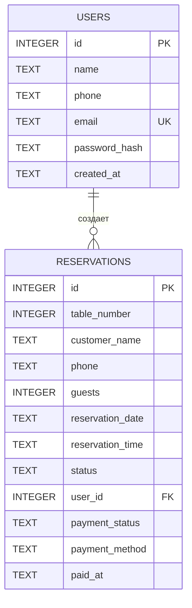

# ER-диаграмма базы данных

## Система бронирования столиков ресторана

ER-диаграмма отражает основные сущности текущей реализации базы данных и связь между ними.

## Описание связи

Связь между сущностями:

`USERS 1 : N RESERVATIONS`

Один зарегистрированный пользователь может иметь несколько бронирований.

Поле `RESERVATIONS.user_id` логически связано с `USERS.id`.

При этом `user_id` является необязательным, поскольку бронирование может быть создано посетителем без регистрации.

## Обозначения

- `PK` — Primary Key, первичный ключ;
- `FK` — Foreign Key, внешний ключ;
- `UK` — Unique Key, уникальное значение;
- `1:N` — связь «один ко многим».
