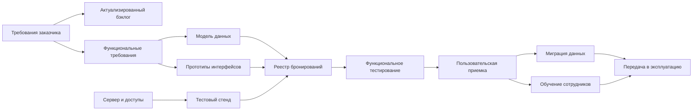

# Карта зависимостей проекта

```mermaid
graph LR
    A[Требования заказчика] --> B[Актуализированный бэклог]
    A --> C[Функциональные требования]

    C --> D[Модель данных]
    C --> E[Прототипы интерфейсов]

    F[Сервер и доступы] --> G[Тестовый стенд]

    D --> H[Реестр бронирований]
    E --> H
    G --> H

    H --> I[Функциональное тестирование]
    I --> J[Пользовательская приемка]

    J --> K[Миграция данных]
    J --> L[Обучение сотрудников]

    K --> M[Передача в эксплуатацию]
    L --> M
```
