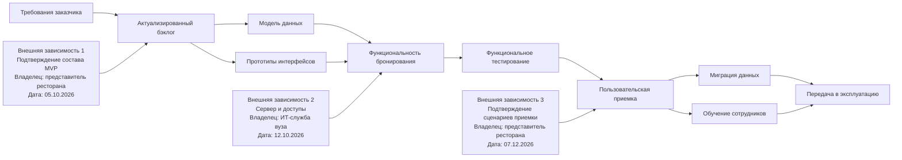

# Карта зависимостей проекта

```mermaid
graph LR

    A["Требования заказчика"] --> B["Актуализированный бэклог"]
    B --> C["Модель данных"]
    B --> D["Прототипы интерфейсов"]

    C --> E["Функциональность бронирования"]
    D --> E

    E --> F["Функциональное тестирование"]
    F --> G["Пользовательская приемка"]

    G --> H["Миграция данных"]
    G --> I["Обучение сотрудников"]

    H --> J["Передача в эксплуатацию"]
    I --> J

    X1["Внешняя зависимость 1<br/>Подтверждение состава MVP<br/>Владелец: представитель ресторана<br/>Дата: 05.10.2026"] --> B

    X2["Внешняя зависимость 2<br/>Сервер и доступы<br/>Владелец: ИТ-служба вуза<br/>Дата: 12.10.2026"] --> E

    X3["Внешняя зависимость 3<br/>Подтверждение сценариев приемки<br/>Владелец: представитель ресторана<br/>Дата: 07.12.2026"] --> G
```
